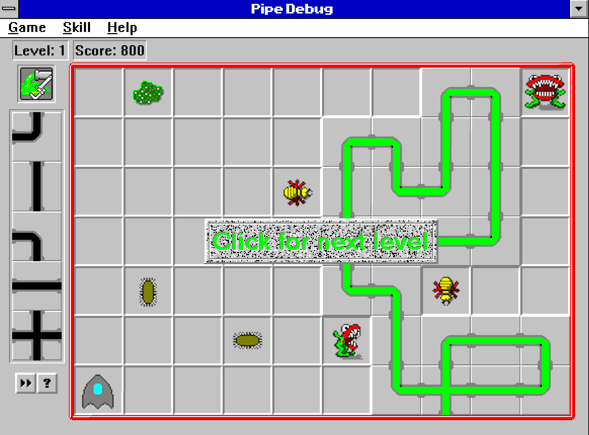

# pipe-debug

<p align="center">
  
</p>

<p align="center">
pipeline debugging and performance measuring microtool.
</p>

<p align="center">
Zero dependency. TypeScript-optimized.  Autocurried.  Immutable.  Short Circuitig.
</p>

## Why it's useful

### Array method chaining

When you're doing stuff like this:
```ts
const output = myArray
  .map(addSomeComputedProperty)
  .map(andDoSomeOtherThing)
  .reduce(onlyTheOriginalAuthorUnderstands)
  .sort()
  .reverse();
```

Add `.map(debugArray())` between those statements to get some `console.log` output for what the values are at that point.  You can also add labels or custom callbacks.

```diff
const output = myArray
  .map(addSomeComputedProperty)
+ .map(debugArray()) // console.log the value at this point in the chain
  .map(andDoSomeOtherThing)
+ .map(debugArray('ziltoid')) // console.log an object: `{ ziltoid: theValueAtThisPoint }`
  .reduce(onlyTheOriginalAuthorUnderstands)
+ .map(debugArray(customLogger)) // override everything with your own custom logger
  .sort()
  .reverse();
```

You can turn it off globally with `setDebugMode(false)`.

### Ramda's [`pipe`](https://ramdajs.com/docs/#pipe)/[`compose`](https://ramdajs.com/docs/#compose) and Lodash's [`flow`](https://lodash.com/docs/#flow)

Works as you would expect, same as above except you use `debugPipe`.

```ts
const addOne = add(1);
const simpleArray = pipe(
  debugPipe(), // just console.logs the value
  map(addOne),
  debugPipe('end'), // console.logs `{ end: theValue }`
  map(addOne),
  debugPipe(customLogger), // sends the value to a custom logger
)([1, 2, 3, 4, 5]);
```

## Performance Metrics

But simple logging isn't all this can do.  It also can track the time it takes for each portion of your pipe, if you're doing pipeline style.

```ts
const output = pipe(
  () => [1, 2, 3],
  startTimings('bigDataProcessingJob'),
  map(add(1)),
  debugPipe('first addition'),
  map(multiply(10)),
  debugPipe('second addition'),
  endTimings(),
)()
```

This outputs a performance report with the milliseconds between each step:

```json
{
  "bigDataProcessingJob": [
    { "first addition": 123.4 },
    { "second addition": 567.8 },
  ]
}
```


## Frequently Asked Questions

> Q: Isn't this like [ramda/tap](https://ramdajs.com/docs/#tap) or [rxjs/tap](https://rxjs-dev.firebaseapp.com/api/operators/tap)?
>
> A: Yes, it is similar.  The difference for me is that it's already wired up and ready for the debugging workflow, complete with labels for ease of use.  Combine that with the performance and timing capabilities, and it's suddenly worth creating this package.

> Q: What's the test coverage for this like?
>
> A: 100%.  Now, I haven't (yet?) instituted [istanbul](https://istanbul.js.org/) to prove it

> Q: How many dependencies are there?
>
> A: Zero.

> Q: Are there TypeScript types?
>
> A: You betcha.

> Q: how can I turn a bunch of statements off all at once without having to comment them out or remove them?
>
> A: just use `setDebugMode` to `false`.  Don't worry, it short circuits so aside from the cost of the function closure and the single if statment at the beginning of the function source, there should be no performance impact.

> Q: Are you using `Date.now()` for the performance timings.
>
> A: Nah.  `performance.now()` is where it's at.  This is also the reason why node v8.5.0 and above is required.

> Q: What's the history of this code?
>
> A: I've been using it for years, actually, and finally decided that instead of copy/pasta'ing it on various projects to just publish an npm for it.

> Q: is "performant" a word
>
> A: sure, why not?
## Caveats

1. This tool is intended for inspection and debugging only.  If you mutate the data in your custom callback... well... then I wish you the best in your future endeavors, haha.  I could use TypeScript to try to make this harder to accidentally do, but opted not to because there are so many existing APIs (including most of `lib.dom`, for example) that don't use `Readonly<>` and `readonly`, even if the functions don't actually mutate.
